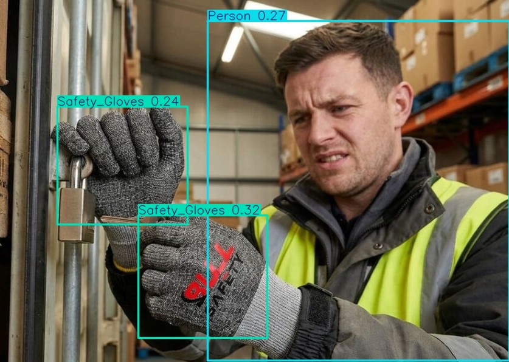
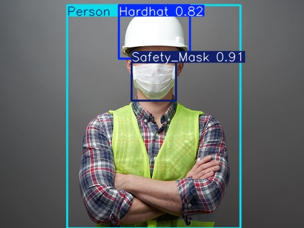
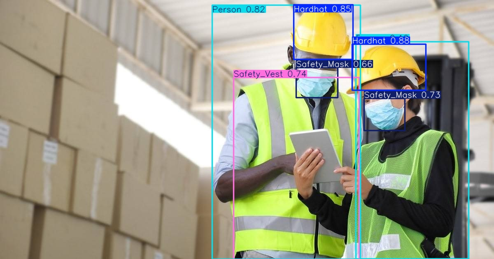
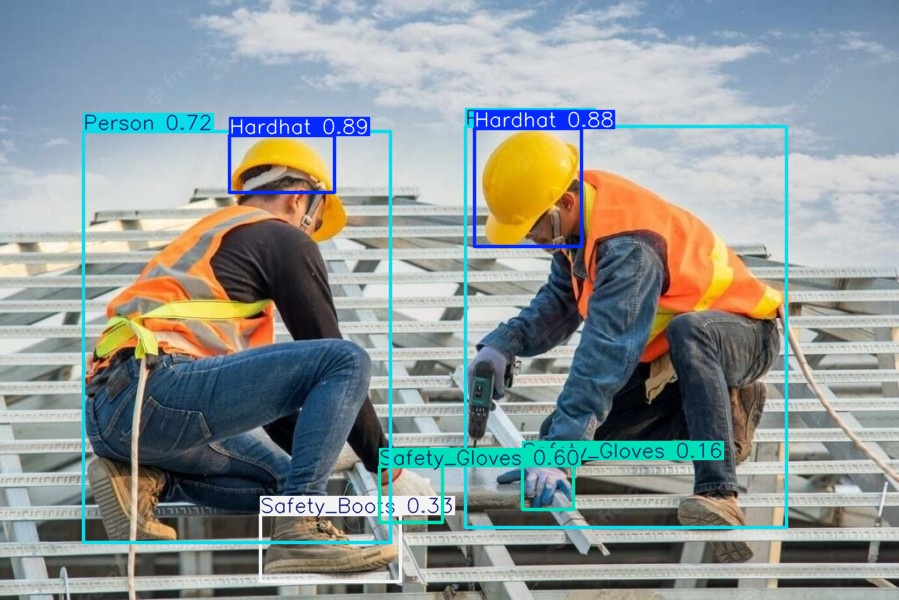
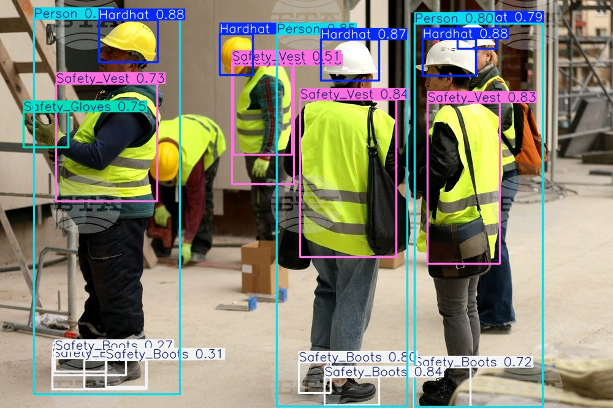
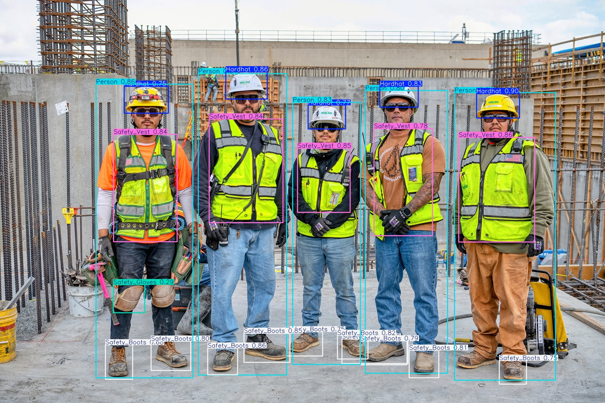

# 🦺 Personal Protective Equipment Detection Using YOLO

This project focuses on detecting Personal Protective Equipment (PPE) using different versions of YOLO. The repository contains training notebooks for **YOLOv12** and **YOLOv8**, as well as an inference script for running the trained model on test images.

<p align="center">
  
  
  
</p>
<p align="center">
  
  
  
</p>

---

# 📁 Project Structure

```
.
├── PPE_Yolov12.ipynb        # Training notebook using YOLOv12
├── PPE_Yolov8.ipynb         # Training notebook using YOLOv8
├── inference.py             # Testing images using trained weights
├── ppe.pt                   # Trained model weights
├── test/                    # Test images
└── output/                  # Output images with detections
```

---

## Dataset

The dataset was collected and annotated using Roboflow.

Classes:
- Person
- Hardhat
- Safety Vest
- Safety Mask
- Safety Gloves
- Safety Boots

---

# 1. Training Using YOLOv12

File:

```
PPE_Yolov12.ipynb
```

## Objective

This notebook trains a PPE detection model using **YOLOv12** inside Google Colab. It creates a dedicated Conda environment, installs dependencies, downloads the dataset from Roboflow, and performs model training.

---

## Workflow

```
Install Miniconda
        ↓
Create Conda Environment
        ↓
Install PyTorch and YOLOv12
        ↓
Install Flash-Attention
        ↓
Download Dataset from Roboflow
        ↓
Train YOLOv12 Model
```

---

## Code Explanation

### Step 1: Install Miniconda

```python
!wget -nc https://repo.anaconda.com/miniconda/Miniconda3-latest-Linux-x86_64.sh
!bash Miniconda3-latest-Linux-x86_64.sh -b -f -p /usr/local
```

Installs Miniconda in the Colab environment.

---

### Step 2: Create a New Environment

```python
!conda create -y -n yolov12 python=3.11
```

Creates a separate Python 3.11 environment named:

```
yolov12
```

---

### Step 3: Install Dependencies

Inside `setup_yolov12.sh`, the following operations are performed:

#### Activate Environment

```bash
conda activate yolov12
```

#### Install PyTorch

```bash
pip install torch torchvision torchaudio
```

PyTorch is installed with CUDA support for GPU acceleration.

#### Clone YOLOv12 Repository

```bash
git clone https://github.com/sunsmarterjie/yolov12.git
```

Downloads the official YOLOv12 implementation.

#### Install Flash Attention

```bash
pip install flash_attn...
```

Flash-Attention speeds up training and improves memory efficiency.

#### Install Required Packages

```bash
pip install -r requirements.txt
```

Installs all required libraries.

---

### Step 4: Download Dataset from Roboflow

```python
rf = Roboflow(api_key='...')
project = rf.workspace(...).project(...)
version = project.version(1)
dataset = version.download('yolov12')
```

Downloads the PPE dataset in YOLOv12 format.

---

### Step 5: Train the Model

```python
model = YOLO('yolov12x.yaml')
```

Creates the YOLOv12 architecture.

Training parameters:

```python
model.train(
    data='/content/dataset/data.yaml',
    epochs=50,
    batch=8,
    imgsz=640,
    scale=0.5,
    mosaic=1.0,
    mixup=0.05,
    copy_paste=0.15,
    device='0'
)
```

### Parameters

| Parameter       | Description                 |
| --------------- | --------------------------- |
| epochs=50       | Number of training epochs   |
| batch=8         | Batch size                  |
| imgsz=640       | Input image size            |
| scale=0.5       | Random scaling augmentation |
| mosaic=1.0      | Mosaic augmentation         |
| mixup=0.05      | MixUp augmentation          |
| copy_paste=0.15 | Copy-Paste augmentation     |
| device='0'      | Use GPU                     |

---

## Final Goal

Train a high-performance YOLOv12 model capable of detecting PPE items.

---

# 2. Training Using YOLOv8

File:

```
PPE_Yolov8.ipynb
```

## Objective

Train a PPE detection model using Ultralytics YOLOv8.

---

## Workflow

```
Download Dataset
        ↓
Install Ultralytics
        ↓
Load Pretrained YOLOv8 Model
        ↓
Train Model
        ↓
Validate Performance
        ↓
Run Inference
```

---

## Code Explanation

### Step 1: Download Dataset

```python
path = kagglehub.dataset_download(...)
```

Downloads the PPE dataset from Kaggle.

---

### Step 2: Download Dataset from Roboflow

```python
dataset = version.download("yolov8")
```

Downloads labels and images in YOLOv8 format.

---

### Step 3: Install Ultralytics

```python
!pip install ultralytics
```

Installs the Ultralytics framework.

---

### Step 4: Load the Model

```python
model = YOLO("yolov8m.pt")
```

Loads the pretrained YOLOv8 Medium model.

---

### Step 5: Train

```python
results = model.train(
    data="/content/dataset/data.yaml",
    epochs=50
)
```

Trains the model for 50 epochs.

---

### Step 6: Validation

```python
results = model.val()
```

Evaluates model performance on the validation dataset.

---

### Step 7: Inference

```python
results = model("/content/image.jpg", save=True)
```

Runs object detection and saves the output image.

---

## Final Goal

Fine-tune YOLOv8 for PPE detection and evaluate its performance.

---

# 3. Inference Using Trained Model

File:

```python
inference.py
```

## Objective

Run the trained model (`ppe.pt`) on a set of test images and save the resulting images with bounding boxes.

---

## Workflow

```
Load Trained Model
        ↓
Read Test Images
        ↓
Perform Detection
        ↓
Draw Bounding Boxes
        ↓
Save Results
```

---

## Code Explanation

### Load Model

```python
model = YOLO("ppe.pt")
```

Loads the trained weights.

---

### Perform Detection

```python
results = model("./test", conf=0.1)
```

Processes all images inside:

```
test/
```

with a confidence threshold of:

```
0.1
```

---

### Create Output Folder

```python
os.makedirs("output", exist_ok=True)
```

Creates the output directory if it does not already exist.

---

### Draw Bounding Boxes

```python
img = result.plot(
    font_size=0.5,
    line_width=2
)
```

Visualization parameters:

| Parameter     | Description            |
| ------------- | ---------------------- |
| font_size=0.5 | Label text size        |
| line_width=2  | Bounding box thickness |

---

### Save Images

```python
cv2.imwrite(
    f"output/image_{i}.jpg",
    img
)
```

Stores the annotated images inside:

```
output/
```

---

# 🚀 Usage

The project can be used in three stages:

1. Train a model using Google Colab.
2. Download the trained weights.
3. Run inference on test images.

---

## Step 1: Train the Model in Google Colab

Two training notebooks are provided:

- `PPE_Yolov12.ipynb`
- `PPE_Yolov8.ipynb`

Upload one of these notebooks to Google Colab and run all cells.

### YOLOv12 Training

```text
PPE_Yolov12.ipynb
```

The notebook will:

1. Install Miniconda.
2. Create a dedicated environment.
3. Install PyTorch and YOLOv12.
4. Download the dataset from Roboflow.
5. Train the model.
6. Save the weights.

The trained weights are generated in:

```text
runs/detect/train/weights/best.pt
```

---

### YOLOv8 Training

```text
PPE_Yolov8.ipynb
```

The notebook will:

1. Download the dataset.
2. Install Ultralytics.
3. Load a pretrained YOLOv8 model.
4. Train the network.
5. Validate the model.
6. Save the trained weights.

The best model is stored in:

```text
runs/detect/train/weights/best.pt
```

---

## Step 2: Download the Trained Model

After training is complete, download:

```text
best.pt
```

Rename it if desired:

```text
ppe.pt
```

---

## Step 3: Clone the Repository

```bash
git clone https://github.com/AliAbutorabi/Personal-Protective-Equipment-Detection.git
cd Personal-Protective-Equipment-Detection
```

---

## Step 4: Create a virtual environment and Install required package

Create a virtual environment:

```bash
python -m venv venv
source venv/bin/activate   # Linux/Mac
venv\Scripts\activate      # Windows
```

```bash
pip install ultralytics
```
---

## Step 5: Place the Model in the Project Directory

Copy the downloaded weights into the root directory of the repository:

```text
.
├── ppe.pt
├── inference.py
├── test/
└── output/
```

---

## Step 6: Add Test Images

Put the images to be processed inside:

```text
test/
```

Example:

```text
test/
├── image1.jpg
├── image2.jpg
└── image3.jpg
```

---

## Step 7: Run Inference

Execute:

```bash
python inference.py
```

---

## Step 8: View Results

Detected objects and bounding boxes will be saved automatically in:

```text
output/
```

Example:

```text
output/
├── image_0.jpg
├── image_1.jpg
└── image_2.jpg
```

---

## Complete Workflow

```text
Open Notebook in Google Colab
                ↓
Train YOLOv8 or YOLOv12
                ↓
Download best.pt
                ↓
Clone Repository
                ↓
Place ppe.pt in Project Directory
                ↓
Add Images to test/
                ↓
Run inference.py
                ↓
Generated Images Appear in output/
```

---

## Example Command

```bash
git clone https://github.com/AliAbutorabi/Personal-Protective-Equipment-Detection.git

cd Personal-Protective-Equipment-Detection

python inference.py
```

## Final Goal

Use the trained model to perform PPE detection on unseen images and save the visualization results.

---

# Technologies Used

- Python
- PyTorch
- Ultralytics YOLOv8
- YOLOv12
- OpenCV
- Roboflow
- KaggleHub
- Google Colab
- CUDA
- Flash-Attention

---

# Output Example

Input image:

```
test/image.jpg
```

↓

Model prediction:

```
Hardhat
Vest
Person
Mask
```

↓

Annotated image:

```
output/image_0.jpg
```

---

# Applications

- Construction site safety monitoring
- Industrial worker protection
- Smart surveillance systems
- Automated PPE compliance inspection
- Real-time safety analytics